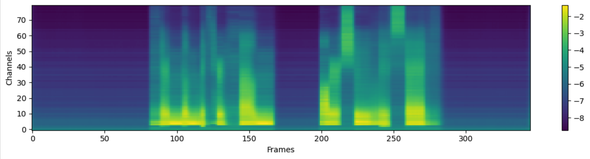

## AdvDualTTS: Dual Style Embeddings with Adversarial Learning in Non-parallel Style Transfer

The content leakage problem in style-transfer text-to-speech (TTS) systems often arises when the semantic contents of reference speech excessively influence the synthesis result, degrading its perceptual quality. To mitigate this problem, we introduce AdvDualTTS, a high-quality TTS system with dual-style embeddings and an adversarial learning strategy. Our TTS model explicitly separates style embeddings into text-dependent and text-independent representations. The former captures the inherent stress patterns of input text using a BERT-based style predictor, while the latter captures the context-free prosody attributes of the reference speech. Additionally, we adopt an adversarial learning strategy to help the model learn how to express various styles in the non-parallel style transfer setting. The subjective and objective experimental results verify the superiority of our TTS system over conventional methods. (MOS: 4.36, ABX Preference Test: 68.26%)

### Generated Speech Samples in Main Result

| Reference Speech                                             | VITS-GST                             | AdvDualTTS                                                 |
| ------------------------------------------------------------ | ------------------------------------------------------------ | ------------------------------------------------------------ |
| <audio src="./samples/1/reference.wav" type="audio/wav" controls="" preload=""></audio> | <audio src="./samples/1/vits_gst.wav" type="audio/wav" controls="" preload=""></audio> | <audio src="./samples/1/advdualtts.wav" type="audio/wav" controls="" preload=""></audio> |
| <audio src="./samples/2/reference.wav" type="audio/wav" controls="" preload=""></audio> | <audio src="./samples/2/vits_gst.wav" type="audio/wav" controls="" preload=""></audio> | <audio src="./samples/2/advdualtts.wav" type="audio/wav" controls="" preload=""></audio> |
| <audio src="./samples/3/reference.wav" type="audio/wav" controls="" preload=""></audio> | <audio src="./samples/3/vits_gst.wav" type="audio/wav" controls="" preload=""></audio> | <audio src="./samples/3/advdualtts.wav" type="audio/wav" controls="" preload=""></audio> |
| <audio src="./samples/4/reference.wav" type="audio/wav" controls="" preload=""></audio> | <audio src="./samples/4/vits_gst.wav" type="audio/wav" controls="" preload=""></audio> | <audio src="./samples/4/advdualtts.wav" type="audio/wav" controls="" preload=""></audio> |
| <audio src="./samples/5/reference.wav" type="audio/wav" controls="" preload=""></audio> | <audio src="./samples/5/vits_gst.wav" type="audio/wav" controls="" preload=""></audio> | <audio src="./samples/5/advdualtts.wav" type="audio/wav" controls="" preload=""></audio> |

### Generated Speech Samples in Ablation Study

| Reference Speech                                             | AdvDualTTS                         | w/o text-dependent style predictor                                             | w/o style embedding discriminator                                                     |
| ------------------------------------------------------------ | ------------------------------------------------------------ | ------------------------------------------------------------ | ------------------------------------------------------------ |
| <audio src="./samples/1/reference.wav" type="audio/wav" controls="" preload=""></audio> | <audio src="./samples/1/advdualtts.wav" type="audio/wav" controls="" preload=""></audio> | <audio src="./samples/1/wo_text_depend.wav" type="audio/wav" controls="" preload=""></audio> | <audio src="./samples/1/wo_text_independ.wav" type="audio/wav" controls="" preload=""></audio> |
| <audio src="./samples/2/reference.wav" type="audio/wav" controls="" preload=""></audio> | <audio src="./samples/2/advdualtts.wav" type="audio/wav" controls="" preload=""></audio> | <audio src="./samples/2/wo_text_depend.wav" type="audio/wav" controls="" preload=""></audio> | <audio src="./samples/2/wo_text_independ.wav" type="audio/wav" controls="" preload=""></audio> |
| <audio src="./samples/3/reference.wav" type="audio/wav" controls="" preload=""></audio> | <audio src="./samples/3/advdualtts.wav" type="audio/wav" controls="" preload=""></audio> | <audio src="./samples/3/wo_text_depend.wav" type="audio/wav" controls="" preload=""></audio> | <audio src="./samples/3/wo_text_independ.wav" type="audio/wav" controls="" preload=""></audio> |
| <audio src="./samples/4/reference.wav" type="audio/wav" controls="" preload=""></audio> | <audio src="./samples/4/advdualtts.wav" type="audio/wav" controls="" preload=""></audio> | <audio src="./samples/4/wo_text_depend.wav" type="audio/wav" controls="" preload=""></audio> | <audio src="./samples/4/wo_text_independ.wav" type="audio/wav" controls="" preload=""></audio> |
| <audio src="./samples/5/reference.wav" type="audio/wav" controls="" preload=""></audio> | <audio src="./samples/5/advdualtts.wav" type="audio/wav" controls="" preload=""></audio> | <audio src="./samples/5/wo_text_depend.wav" type="audio/wav" controls="" preload=""></audio> | <audio src="./samples/5/wo_text_independ.wav" type="audio/wav" controls="" preload=""></audio> |

### Average Speech Sample
| Original Speech                    |  Average Speech                                               |   
|-------------------------------------|-------------------------------------|
|  |  |
| <audio src="./samples/average/original.wav" type="audio/wav" controls="" preload=""></audio> | <audio src="./samples/average/average.wav" type="audio/wav" controls="" preload=""></audio> | 

